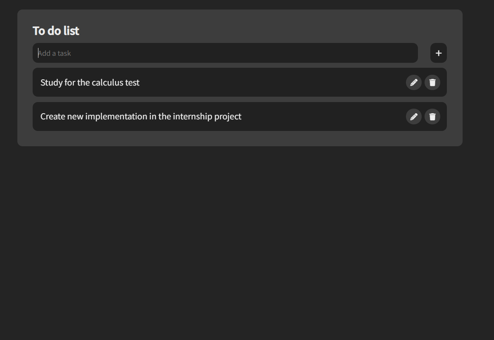

# Simple To-Do List

This repository features a simple To-Do List application created with HTML, CSS, and JavaScript. The app enables users to add tasks, edit existing ones, and delete tasks. It provides a practical example of using JavaScript for dynamic DOM manipulation and event handling. The project is responsive, ensuring it works well across different devices and screen sizes.



## Installation

To get started with this project:

1. Clone the repository to your local machine:
   ```bash
   git clone https://github.com/belacartaxo/simple-to-do-list.git
2. Navigate to the project directory:
   ```bash
   cd todo-list
3. Open the index.html file in your preferred web browser to run the application.

## Usage
To use the To-Do List application:
1. Open the index.html file in a web browser.
2. Add tasks by typing in the input field and clicking the "Add" button or pressing Enter.
3. Edit tasks by clicking the edit button next to the task you want to modify.
4. Delete tasks by clicking the trash button next to the task you want to remove.

## Code Overview
The JavaScript code for this project handles the following functionalities:

- Adding Tasks: Listens for clicks on the "Add" button and Enter key presses to create new tasks.
- Editing Tasks: Opens an edit window allowing users to modify the content of a task.
- Deleting Tasks: Provides a delete button to remove tasks from the list.
- Dynamic Elements: Uses DOM manipulation to dynamically create, update, and remove task elements.

## Author
This repository is maintained by Your [Isabela Cartaxo](https://github.com/belacartaxo).
